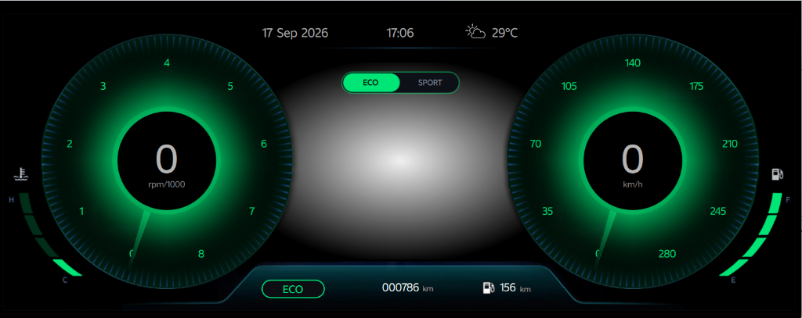
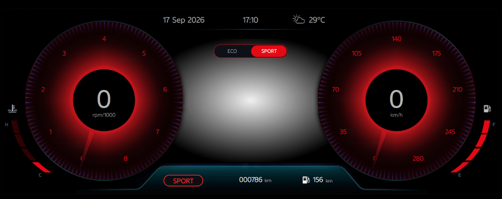

# CarDashHMI — Next-Gen Automotive Digital Instrument Cluster

[](https://www.qt.io/)
[](https://isocpp.org/)
[](https://doc.qt.io/qt-6/qtqml-index.html)
[](LICENSE)

CarDashHMI is a high-performance Human-Machine Interface (HMI) digital instrument cluster developed using Qt 6 and QML. Designed for next-generation connected vehicles, it features interactive digital gauges, live map navigation, real-time weather status via an OpenWeather API C++ backend, media controls, and adaptive UI layouts.

---

## Interface Preview

### ECO Mode


---

### SPORT Mode


---

## Key Features

- **Digital Gauges & Indicators**:
  - High-precision animated Speedometer and Tachometer gauges.
  - Multi-state dynamic bar indicators for battery, fuel, temperature, and vehicle metrics.
  - Smooth QML property animations and custom demo modes.

- **Interactive Navigation & Map View**:
  - Embedded MapboxGL plugin integration (`PageMap.qml`) supporting custom map styles, route rendering, and location markers.
  - Dynamic positioning with customizable bearing, zoom levels, and route lines.

- **Real-Time Weather Integration**:
  - C++ `Weather` backend fetching real-time weather conditions and temperature updates via OpenWeather API.
  - Weather status icons reflecting clear, cloudy, rainy, snowy, misty, and storm conditions.

- **Infotainment & Media Player**:
  - Sleek media playback controls (`PageMedia.qml`) with track info, playback toggles, album artwork display, and playlist navigation.

- **Adaptive & Responsive Layout**:
  - Modular top navigation toolbar and bottom footer status bar.
  - JavaScript-powered layout adapter (`AdaptiveLayoutManager.js`) ensuring seamless scaling across diverse automotive display resolutions.

---

## Technology Stack

| Component | Technology |
| :--- | :--- |
| **GUI Framework** | Qt 6 (Qt Quick, QML) |
| **Core Logic** | C++11 / C++17 |
| **Map Plugin** | MapboxGL (`QtLocation` / `QtPositioning`) |
| **Weather API** | C++ `QNetworkAccessManager` (OpenWeatherMap API) |
| **Build System** | `qmake` (`CarDashHMI.pro`) |
| **License** | Apache License 2.0 |

---

## Project Structure

```text
CAR-DASH-HMI/
├── screenshots/                   # Application preview screenshots
│   ├── eco_mode.png               # ECO mode (Green Theme) interface
│   └── sport_mode.png             # SPORT mode (Red Theme) interface
├── Car_dash_HMI/
│   ├── CarDashHMI/
│   │   ├── Assets/                # Fonts, icons, background images, weather icons
│   │   ├── CustomComponents/      # Reusable QML components & pages
│   │   │   ├── Pages/             # PageMap.qml, PageMedia.qml
│   │   │   ├── BarIndicator.qml   # Animated status bar indicators
│   │   │   ├── DemoAnimation.qml  # Gauge & UI demo animations
│   │   │   ├── FooterBar.qml      # Bottom status footer
│   │   │   ├── Gauge.qml          # Customizable circular gauge component
│   │   │   ├── MenuSection.qml    # Navigation menu switcher
│   │   │   ├── ToolBar.qml        # Top toolbar component
│   │   │   └── WeatherStatusIcon.qml
│   │   ├── JavascriptScripts/     # AdaptiveLayoutManager.js
│   │   ├── Weather/               # C++ Weather service backend (API request handler)
│   │   │   ├── weather.cpp
│   │   │   ├── weather.h
│   │   │   └── weather.pri
│   │   ├── CarDashHMI.pro         # Qt project configuration file
│   │   ├── main.cpp               # C++ entry point & context property registrations
│   │   ├── main.qml               # Primary QML UI container
│   │   └── qml.qrc                # QML resource file
├── LICENSE                        # Apache 2.0 License
└── README.md                      # Project documentation
```

---

## Program Code & Component Architecture Explanation

The CarDashHMI application follows a decoupled C++/QML architecture using Qt 6:

### 1. Main Entry Point (`main.cpp`)
- **Application Initialization**: Instantiates `QGuiApplication` and `QQmlApplicationEngine` to initialize the Qt runtime environment.
- **QML Type & Property Registration**:
  - Registers the `Weather::WeatherState` enum using `qmlRegisterUncreatableType<Weather>()` under the namespace `weather.enum`, allowing QML files to reference enum values like `Weather.Clear` or `Weather.Rain`.
  - Instantiates the C++ `Weather` backend object and exposes it globally to QML using `engine.rootContext()->setContextProperty("weather", weather.get())`.

### 2. C++ Weather Backend (`Weather/weather.h` & `Weather/weather.cpp`)
- **Qt Property Integration**: Exposes `weatherState` and `ambientTemperature` as `Q_PROPERTY` bindings with `NOTIFY` signals (`weatherStateChanged` and `ambientTemperatureChanged`).
- **Asynchronous Networking**: Uses `QNetworkAccessManager` to issue HTTP GET requests to the OpenWeatherMap API (`api.openweathermap.org`).
- **Data Parsing & Conversion**:
  - `extractTemperature()`: Parses the JSON response object, extracts the Kelvin temperature, and converts it to Celsius (`Kelvin - 273.15`).
  - `extractMainWeather()` & `mainWeatherToEnum()`: Extracts the primary weather string (e.g. "Clear", "Clouds", "Rain", "Snow", "Mist") and converts it into strong-typed `WeatherState` enum values.
- **Reactivity**: Upon receiving network replies, property setter methods trigger signal emissions that immediately update bound QML elements in real time.

### 3. Primary Window & Layout (`main.qml`)
- Serves as the master user interface container.
- Embeds top `ToolBar`, middle menu navigation (`MenuSection`), dynamic page views, and bottom `FooterBar`.
- Manages view switching between cluster gauges, map navigation, and media player interfaces.

### 4. Custom QML UI Components (`CustomComponents/`)
- **`Gauge.qml`**: Implements a reusable circular instrument cluster gauge (Speedometer / Tachometer) featuring custom artwork, rotational needle transforms, and property animations.
- **`BarIndicator.qml`**: Renders multi-segment vertical/horizontal bar graphs representing vehicle telemetry such as battery level, fuel level, and oil temperature.
- **`DemoAnimation.qml`**: Provides an automated demonstration sequence that cycles vehicle speed, RPM, and bar levels across range values to simulate live driving metrics without physical hardware connections.
- **`WeatherStatusIcon.qml`**: Binds directly to the C++ `weather.weatherState` context property to switch displayed weather asset icons dynamically based on real-time API state.
- **`ToolBar.qml` & `FooterBar.qml`**: Provide structured header and footer status information (time, connectivity status, ambient temperature, system state).

### 5. Page Views (`CustomComponents/Pages/`)
- **`PageMap.qml`**: Integrates `QtLocation` with the `mapboxgl` plugin. Configures map viewport coordinates, bearing, zoom levels, car position markers (`CarMarker.png`), location markers (`LocationMarker.png`), and route overlay polylines (`MapRoute`).
- **`PageMedia.qml`**: Renders the infotainment media player UI, including album art visualization, song details, track time sliders, play/pause controls, and volume indicators.

### 6. Adaptive Layout Utility (`JavascriptScripts/AdaptiveLayoutManager.js`)
- JavaScript helper script imported into QML components.
- Dynamically computes element dimensions, margins, and scaling factors based on screen dimensions to maintain consistent design proportions across varying display aspect ratios and resolutions.

---

## Getting Started

### Prerequisites

- **Qt 6.x** (with `Qt Quick`, `Qt Location`, `Qt Positioning`, and `Qt 5 Compatibility` modules installed).
- **C++11** compliant compiler (GCC, Clang, or MSVC).
- **Qt Creator** (Recommended IDE) or command-line build tools (`qmake` / `make`).
- (Optional) **Mapbox Access Token** for full map tile rendering.

---

## Building and Running

### Method 1: Using Qt Creator (Recommended)

1. Open **Qt Creator**.
2. Select **Open File or Project...** and choose `Car_dash_HMI/CarDashHMI/CarDashHMI.pro`.
3. Select your Qt 6 Kit (e.g., Qt 6.5 Desktop MSVC / MinGW / GCC).
4. Click **Build & Run** (`Ctrl + R` / `Cmd + R`).

### Method 2: Command Line (`qmake`)

```bash
# 1. Clone the repository
git clone https://github.com/work-with-ram/Car_Dash_HMI.git
cd Car_Dash_HMI/Car_dash_HMI/CarDashHMI

# 2. Run qmake
qmake CarDashHMI.pro

# 3. Build the project
# On Linux / macOS:
make -j$(nproc)

# On Windows (MinGW):
mingw32-make

# 4. Run the executable
./CarDashHMI
```

---

## Configuration

### Mapbox Access Token
To enable Mapbox tiles in the navigation view:
1. Open [`Car_dash_HMI/CarDashHMI/CustomComponents/Pages/PageMap.qml`](Car_dash_HMI/CarDashHMI/CustomComponents/Pages/PageMap.qml).
2. Locate the Mapbox plugin parameters:
   ```qml
   PluginParameter { 
       name: "mapboxgl.access_token"; 
       value: "YOUR_MAPBOX_ACCESS_TOKEN" 
   }
   ```
3. Replace `"YOUR_MAPBOX_ACCESS_TOKEN"` with your valid Mapbox API key.

---

## License

This project is licensed under the **Apache License 2.0** - see the [LICENSE](LICENSE) file for details.

---

## Author

Developed & Maintained by **[work-with-ram](https://github.com/work-with-ram)**.
